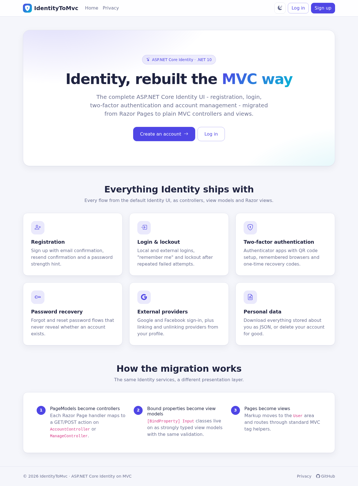
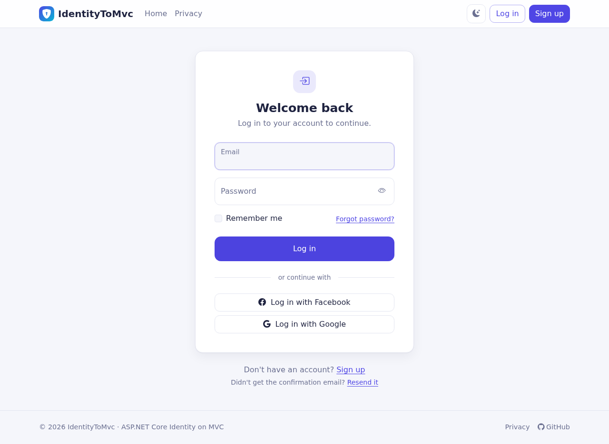
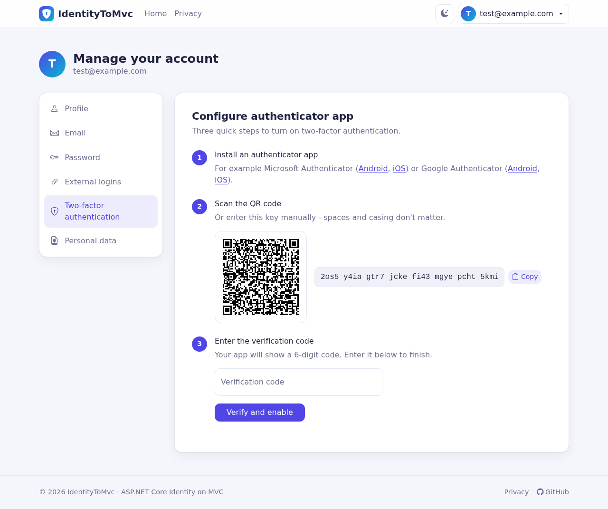
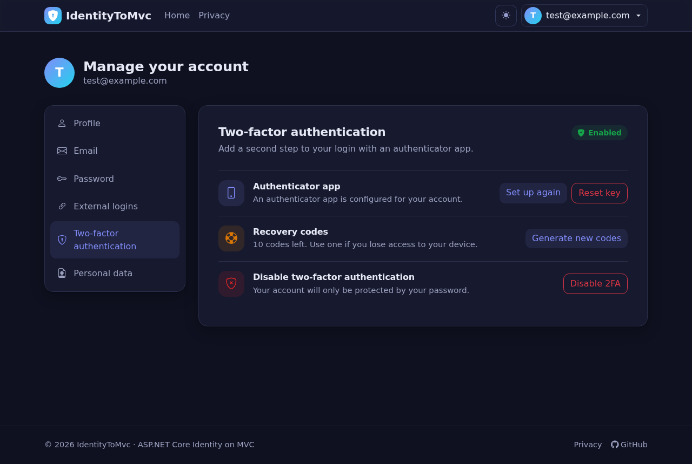
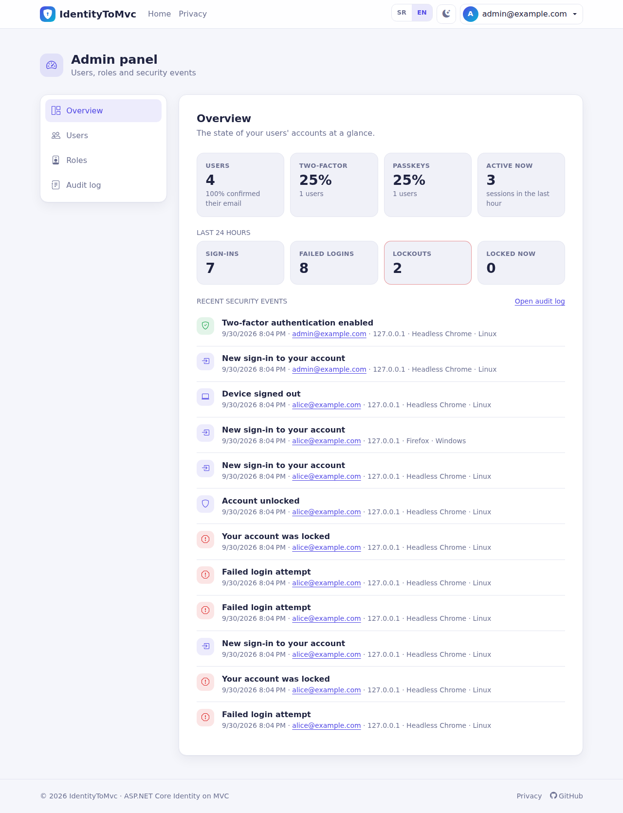
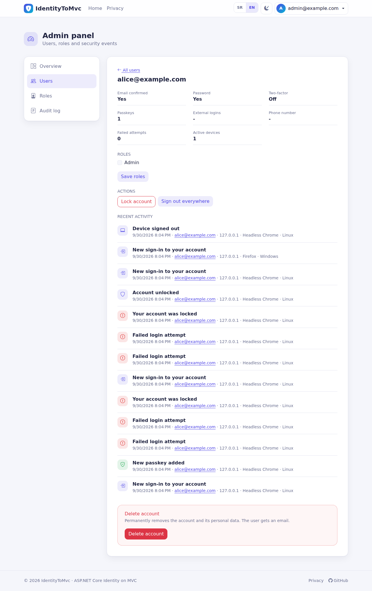
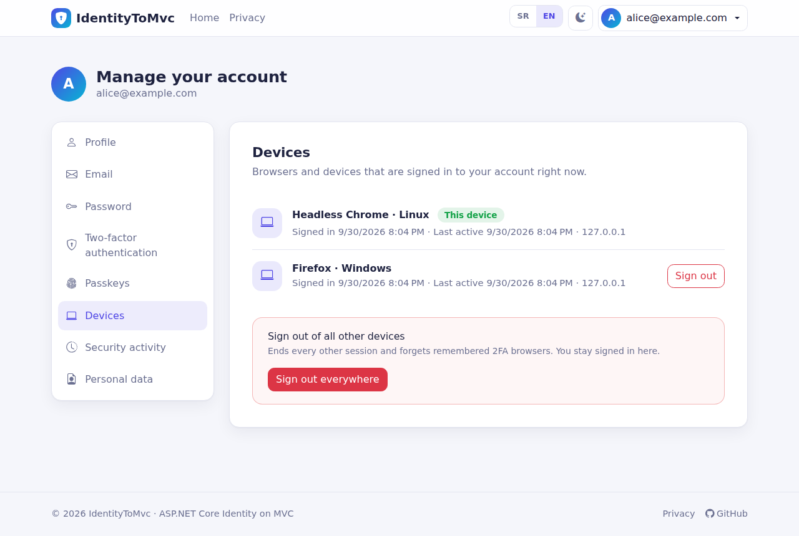
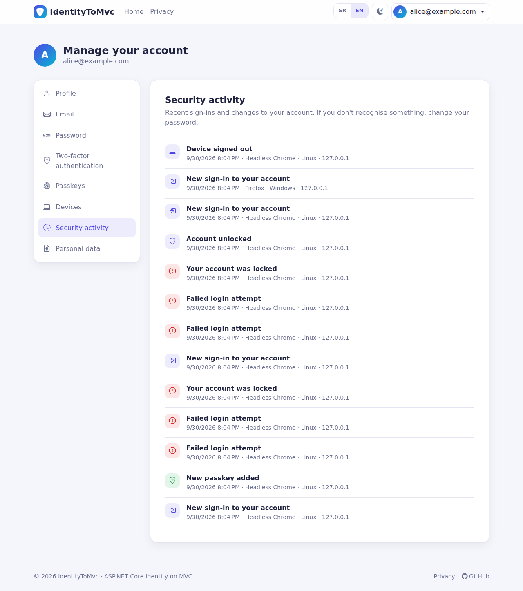
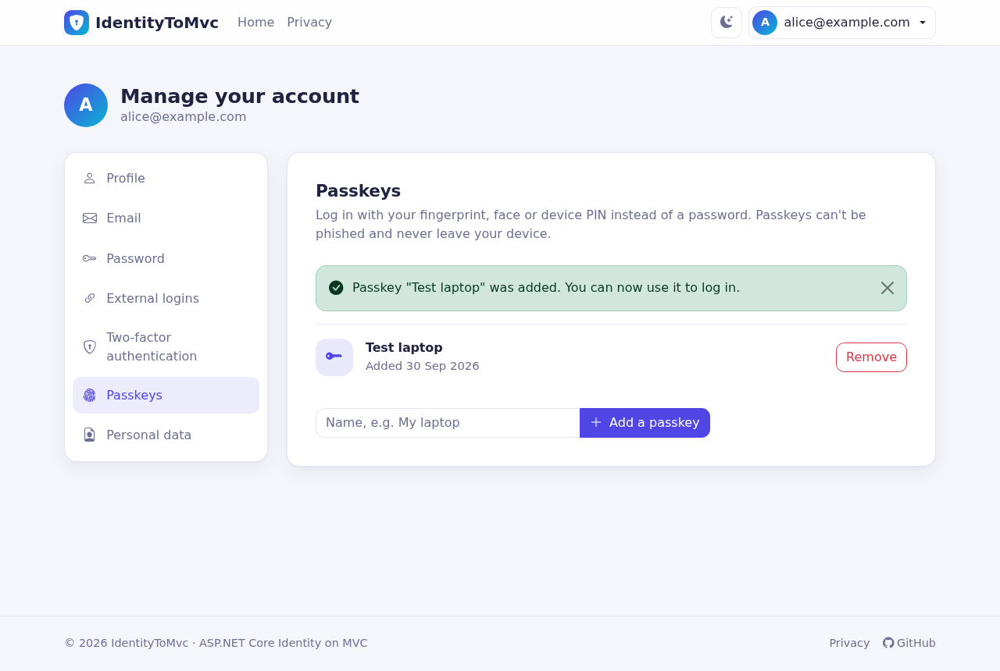

# IdentityToMvc

Migracija **ASP.NET Core Identity** iz Razor Pages u **MVC arhitekturu**.  
Projekat prikazuje kako prevesti standardne Identity RCL stranice u MVC controllere i view-e.

---

## Funkcionalnosti
- **Auth**: registracija, login/logout, eksterni provideri, potvrda email-a  
- **Bezbednost**: reset lozinke, 2FA sa QR kodom, recovery kodovi, zaključavanje naloga posle 3 neuspešna pokušaja, 2FA važi i za eksterne prijave  
- **Profil**: izmena lozinke/email-a/podataka, spoljašnji nalozi, brisanje podataka  
- **Uređaji i aktivnost**: spisak svih prijavljenih uređaja sa odjavom svakog pojedinačno; vremenska linija bezbednosnih događaja (prijave, neuspeli pokušaji, izmene naloga); mejl kada se prijavi novi uređaj  
- **Admin panel** (`/Admin`): pregled, pretraga korisnika, detalji korisnika (zaključaj/otključaj, odjavi sa svih uređaja, resetuj 2FA, potvrdi mejl, uloge, brisanje), upravljanje ulogama i kompletan audit log  
- **Lokalizacija**: srpski (latinica) i engleski, bira se po jeziku browsera ili prekidačem SR/EN; prevedeni su i mejlovi, poruke validacije i Identity greške  
- **UI**: Bootstrap 5.3 + Bootstrap Icons, svetla/tamna tema, indikator jačine lozinke i prikaz/sakrivanje lozinke, responsive layout  
- **Testovi i CI**: integracioni testovi (`IdentityToMvc.Tests`) pokreću celu aplikaciju u memoriji; GitHub Actions na svaki push radi build, testove i proveru prevoda  

| Početna | Prijava |
|---------|---------|
|  |  |

| Podešavanje authenticator-a | 2FA podešavanja (tamna tema) |
|-----------------------------|------------------------------|
|  |  |

| Admin panel | Admin: detalji korisnika |
|-------------|--------------------------|
|  |  |

| Tvoji uređaji | Bezbednosna aktivnost |
|---------------|-----------------------|
|  |  |
  
> 📘 **Detaljno uputstvo na srpskom** - kako sve radi, koji deo preneti za koju funkcionalnost i kako uključiti samo osnovno: [docs/UPUTSTVO.md](docs/UPUTSTVO.md)

---

## Bezbednost

Pored podrazumevanih Identity podešavanja, aplikacija dodaje:

| Oblast | Šta radi |
|--------|----------|
| **Passkeys (WebAuthn)** | Prijava bez lozinke, otporna na phishing - Face ID / Touch ID / Windows Hello / sigurnosni ključevi (.NET 10 Identity passkeys, šema v3). Passkey autofill u polju za email, obavezna verifikacija korisnika. Upravljanje u *Manage account &rarr; Passkeys*. |
| **Sudo mode** | Osetljive izmene (2FA, recovery kodovi, email, eksterni nalozi, passkeys, preuzimanje podataka) traže ponovo lozinku ako je od poslednje prijave prošlo više od 15 minuta. |
| **Zaključavanje** | 3 neuspešna pokušaja zaključavaju nalog na 10 minuta (login, 2FA kodovi, potvrda identiteta, brisanje naloga). |
| **Rate limiting** | Ograničenja po IP adresi za forme naloga (20/min) i za rute koje šalju email (5 na 10 min), odgovor `429` sa `Retry-After`. |
| **Politika lozinki** | 8+ karaktera sa velikim/malim slovom, cifrom i simbolom; ne sme sadržati email; provera u [Have I Been Pwned](https://haveibeenpwned.com/Passwords) bazi procurelih lozinki preko k-anonymity (samo 5 karaktera heša napušta server; ako API nije dostupan, provera se preskače). |
| **Heširanje lozinki** | PBKDF2-HMAC-SHA512 sa 600.000 iteracija; stari heševi se automatski unapređuju pri sledećoj prijavi. |
| **Sesije** | Svaka prijava je sesija na serveru: korisnik vidi svoje uređaje i može odmah da ugasi bilo koji, „odjavi me sa svih uređaja“, security stamp se proverava na 5 minuta, promena lozinke/2FA gasi ostale sesije a trenutnu zadržava. Mejl pri prijavi sa novog uređaja. |
| **Bezbednosna obaveštenja** | Email + audit log u bazi (`SecurityEvents`) i u logu aplikacije (`Security audit: <Event>`) za prijave, neuspele pokušaje, promene lozinke/emaila/2FA/passkey-a/načina prijave, zaključavanja, radnje administratora i brisanje naloga. Stari zapisi se brišu automatski. |
| **Bez otkrivanja naloga** | Registracija, ponovno slanje potvrde i reset lozinke odgovaraju isto za nepostojeće naloge; mejlovi idu kroz pozadinski red, a prijava traje isto bez obzira da li nalog postoji. |
| **Preuzimanje naloga unapred** | Registracija već potvrđenog mejla samo obaveštava vlasnika; nepotvrđen nalog ne može da „rezerviše“ adresu (nova registracija ga zamenjuje); spoljne prijave se nikad same ne povezuju sa postojećim nalogom. |
| **Zloupotreba zaključavanja** | Vlasnik zaključanog naloga dobija link za otključavanje i može da se prijavi passkey-om, pa neko drugi ne može da mu drži nalog zaključanim. Nalog koji je zaključao administrator ostaje zaključan. |
| **Tajne u bazi** | Authenticator (TOTP) ključevi su šifrovani, recovery kodovi se čuvaju samo kao PBKDF2 heševi; Data Protection ključevi se mogu šifrovati sertifikatom. |
| **Admin panel** | Samo za ulogu `Admin`, i tek kada administrator uključi 2FA ili passkey. Administrator ne može da zaključa ili ukloni sebi ulogu, niti da obriše poslednjeg administratora; svaka radnja se upisuje u audit log. |
| **Kolačići** | `__Host-` prefiks, `Secure`, `HttpOnly`; antiforgery kolačić `SameSite=Strict`. |
| **Zaglavlja** | Content-Security-Policy sa nonce-om po zahtevu (bez inline skripti), HSTS (1 godina), `X-Frame-Options`, `nosniff`, `Referrer-Policy`, `Permissions-Policy`, COOP/CORP, bez `Server` zaglavlja, `no-store` na stranicama naloga. |
| **Tokeni i ključevi** | Linkovi za potvrdu/reset ističu posle 3 sata; Data Protection ključevi se čuvaju u bazi pa tokeni i kolačići preživljavaju restart i rade na više instanci. |

Podešavanja (`Security` sekcija u `appsettings.json`):

```json
"Security": {
  "EnableTwoFactor": true,
  "EnablePasskeys": true,
  "RequireRecentAuthentication": true,
  "EnableRateLimiting": true,
  "CheckBreachedPasswords": true,
  "SendSecurityNotifications": true,
  "MaxPasskeysPerUser": 10,
  "PasskeyServerDomain": "",      // npr. "example.com" - podrazumevano host iz zahteva
  "KnownProxies": [],             // IP adrese reverse proxy-ja kojima se veruje za X-Forwarded-*
  "RequireTwoFactorForAdmins": true,
  "AuditRetentionDays": 365,
  "SessionRetentionDays": 30,
  "DataProtectionCertificatePath": "",     // .pfx koji šifruje Data Protection ključeve (preporuka za produkciju)
  "DataProtectionCertificatePassword": ""
},
"Admin": {
  "Emails": [ "ti@example.com" ]   // postaju administratori čim potvrde mejl
},
"Localization": {
  "DefaultCulture": "sr-Latn-RS"  // ili "en"; koristi se kada browser ne traži nijedan od ta dva jezika
}
```

> Passkeys zahtevaju HTTPS (ili `localhost`). Posle ovih izmena napravi novu migraciju - šema sada
> sadrži tabele za passkeys, Data Protection ključeve, `SecurityEvents` i `UserSessions`.



---

## Preduslovi
- [.NET SDK 10.x](https://dotnet.microsoft.com/download/dotnet/10.0)
- Visual Studio 2026 (preporučeno) ili VS Code + C# Dev Kit  
- SQL Server / LocalDB / SQL Express  
- `dotnet-ef` alat: `dotnet tool install --global dotnet-ef`  
- (Opcionalno) SMTP server za slanje mailova (Mailtrap, Papercut ili pravi SMTP)

---

## Brzi start (lokalno)

1. **Kloniraj repozitorijum**
```bash
git clone https://github.com/MarkoLazic4/IdentityToMvc.git
cd IdentityToMvc
```

2. **Otvori rešenje u Visual Studio / VS Code**

3. **Konfiguriši appsettings.Local.json ili koristi user-secrets**

`appsettings.Local.json` (naveden u `.gitignore`) ima prednost nad `appsettings.json`:

```json
{
  "ConnectionStrings": {
    "Default": "Server=(localdb)\\MSSQLLocalDB;Database=IdentityToMvc;Trusted_Connection=True;TrustServerCertificate=True"
  },
  "SMTP": {
    "Host": "smtp.example.com",
    "Port": 587,
    "EnableSsl": true,
    "Username": "user@example.com",
    "Password": "tvoja-lozinka",
    "From": "no-reply@example.com",
    "FromName": "IdentityToMvc"
  },
  "GoogleClientId": "...",
  "GoogleClientSecret": "...",
  "FacebookAppId": "...",
  "FacebookAppSecret": "..."
}
```

4. **Kreiraj i primeni migracije**

```bash
cd IdentityToMvc.Web
dotnet ef migrations add InitialIdentitySchema -o Data/Migrations
dotnet ef database update
```

**ILI (Visual Studio — Package Manager Console)**

```powershell
Add-Migration InitialIdentitySchema -OutputDir Data/Migrations
Update-Database
```
5. **Pokreni aplikaciju**

```bash
dotnet run
```

U `Development` okruženju stranica za potvrdu registracije direktno prikazuje link za potvrdu email-a, pa možeš da testiraš i bez SMTP servera.

6. **Postani administrator** - upiši svoj mejl u `Admin:Emails`, registruj se (ili restartuj aplikaciju ako nalog već
   postoji) i potvrdi mejl. Uključi dvofaktorsku prijavu ili passkey, pa iz korisničkog menija otvori *Admin panel*.

---

## Testovi

```bash
dotnet test --project IdentityToMvc.Tests
```

Testovi pokreću pravu aplikaciju u memoriji sa SQLite bazom i lažnim poštanskim sandučetom - nisu potrebni SQL
Server ni SMTP. Pokrivaju registraciju, zaštitu od preuzimanja naloga, zaključavanje i link za otključavanje, tajne u
bazi, sesije uređaja, admin panel, sigurnosna zaglavlja i lokalizaciju.

## Prevodi

Tekstovi su u kodu napisani na engleskom (`L["..."]` u view-ovima, `_t["..."]` u kontrolerima), a prevodi su u
`IdentityToMvc.Web/Resources/SharedResource.sr-Latn.resx`. Posle dodavanja ili izmene teksta pokreni

```bash
python3 tools/extract_keys.py
```

Skripta ispisuje svaki tekst koji još nema srpski prevod (CI ne prolazi dok neki nedostaje).

# Licenca & Kontakt

* **Licenca:** MIT
* **GitHub:** [@MarkoLazic](https://github.com/MarkoLazic4)
